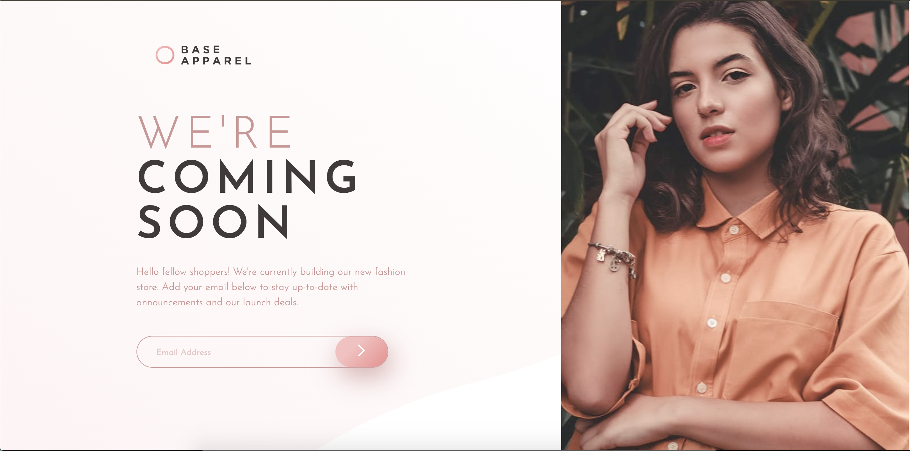
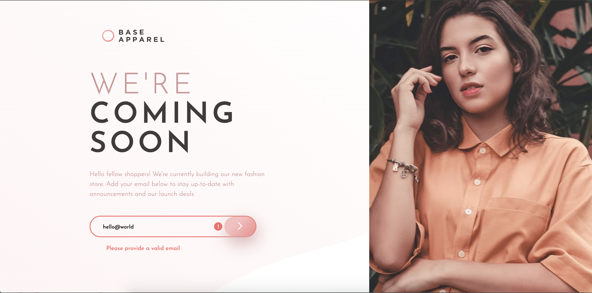

# BaseApparelComingSoon

This is the Base Apparel coming soon page challenge from [Frontend Mentor](https://www.frontendmentor.io/challenges/base-apparel-coming-soon-page-5d46b47f8db8a7063f9331a0). Below you can view the solution to this challenge. 

# Overview

## The Challenge

Your users should be able to:

* View the optimal layout for the site depending on their device's screen size
* See hover states for all interactive elements on the page
* Receive an error message when the `form` is submitted if:
  * The `input` field is empty
  * The email address is not formatted correctly

  ## Screenshots

  
  
  

  ## Links

  * [Solution URL](https://github.com/AOA19/BaseApparelComingSoon.git)
  * [Live Site URL](https://aoa19.github.io/BaseApparelComingSoon/)

# The Process

## Built With:
* Semantic HTML5 Markup
* Flexbox
* Mobile-first approach 

# Author

* Github: [@AOA19](https://github.com/AOA19)
* Frontend Mentor: [@AOA19](https://www.frontendmentor.io/profile/AOA19)